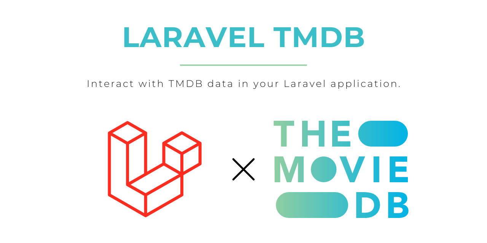

# Laravel TMDB

[](https://packagist.org/packages/astrotomic/laravel-tmdb)
[](https://github.com/Astrotomic/laravel-tmdb/blob/master/LICENSE)
[](https://forest.astrotomic.info)
[](https://larabelles.com)

[](https://github.com/Astrotomic/laravel-tmdb/actions?query=workflow%3Apest)
[](https://github.com/Astrotomic/laravel-tmdb/actions?query=workflow%3Aphpcs)

[](https://packagist.org/packages/astrotomic/laravel-tmdb)
[](https://forest.astrotomic.info)
[](https://forest.astrotomic.info)

## Installation

```bash
composer require astrotomic/laravel-tmdb
php artisan vendor:publish --tag=tmdb-migrations
```

## Configuration

Add your [TMDB API v4 Token](https://www.themoviedb.org/settings/api) to the `config/services.php` file.

**config/services.php**
```php
return [
    // ...
    
    'tmdb' => [
        'token' => env('TMDB_TOKEN'),
    ],

    // ...
];
```

After that you can configure your language and region to be used by the package for some of the API requests.
By default we use `app()->getLocale()` for the language and a hardcoded `US` region.
It's recommended to call this in your `AppServiceProvider` but you can call the methods from everywhere in your codecase.
In case you want to run a specific callback with a region or language without changing the globally used ones you can use the `with` methods.
These will set the region or language to teh given one for the callback and automatically restore the old one after running the callback.

```php
use Astrotomic\Tmdb\Facades\Tmdb;

Tmdb::useLanguage('de');
Tmdb::useRegion('DE');

Tmdb::withLanguage('de', fn() => \Astrotomic\Tmdb\Models\Movie::find(335983));
Tmdb::withRegion('DE', fn() => \Astrotomic\Tmdb\Models\Movie::upcoming(20));
```

## Usage

### Models

The easiest and most feature complete way to use the package are the provided models.
They come with custom query builders which do API calls if the requested model isn't found in your local database.
This only applies to the `find()` and sometimes the `all()` methods.
So if you only want to query your database, you can do so by using `whereKey()->first()` for example.

```php
use Astrotomic\Tmdb\Models\Movie;

Movie::find(335983);
Movie::findMany([335983, 575788]);
Movie::findOrFail(335983);
```

It's recommended to prepare two "static" models to save future calls by calling their `all()` method once.
This will do one HTTP call per model and save multiple HTTP calls in the future.

```php
use Astrotomic\Tmdb\Models\MovieGenre;
use Astrotomic\Tmdb\Models\TvGenre;
use Astrotomic\Tmdb\Models\WatchProvider;

MovieGenre::all();
TvGenre::all();
WatchProvider::all();
```

Most models use [spatie/laravel-translatable](https://github.com/spatie/laravel-translatable) with a slightly customized `translate()` method.
This will automatically load a missing translation if you request it.

```php
use Astrotomic\Tmdb\Models\Movie;

app()->setLocale('en');
$movie = Movie::find(335983);
$movie->translate('title', 'en'); // get title from DB
$movie->translate('title', 'de'); // get and persist title from API
```

If you want to update the data in your database you can call the `updateFromTmdb()` method on any of the models.
This should be done a console command or queue job as it will do a lot of HTTP requests and can take few minutes per movie.

```php
use Astrotomic\Tmdb\Models\Movie;

Movie::eachById(static function(Movie $movie): void {
    $movie->updateFromTmdb('de', ['credits']);
});
```

#### Movie

First of all you can also `find()` a movie with additional relations and they will also be queried from the API.
To do so you only have to call the `with()` method on the query before you call any of the `find()` methods.

```php
use Astrotomic\Tmdb\Models\Movie;

Movie::with('genres')->find(335983);
Movie::with('credits')->find(335983);
Movie::with('cast')->find(335983);
Movie::with('crew')->find(335983);
```

There are some methods that do a HTTP call every single time.
And if they accept a `$limit` argument they automically call each page till the amount of IDs is found.
You have to provide an explicit argument, in case you use `null` it will call **every** page.
This can result in several thousands of requests - so it's more recommended to provide a serious number.

```php
use Astrotomic\Tmdb\Models\Movie;

Movie::popular(20);
Movie::upcoming(20);
Movie::toprated(20);
Movie::trending(20);
Movie::nowPlaying(20);

Movie::findOrFail(335983)->recommendations(20);
Movie::findOrFail(335983)->similars(20);
```

You can also get all watch providers (powered by [JustWatch](https://justwatch.com)) for a given movie.
These can be filtered/limited to a given region and/or type.

```php
use Astrotomic\Tmdb\Models\Movie;
use Astrotomic\Tmdb\Enums\WatchProviderType;

Movie::findOrFail(335983)->watchProviders();
Movie::findOrFail(335983)->watchProviders('DE');
Movie::findOrFail(335983)->watchProviders(null, WatchProviderType::FLATRATE());
Movie::findOrFail(335983)->watchProviders('DE', WatchProviderType::FLATRATE());
```

And there are some helper methods on the movie model to easier work with some attributes.

```php
use Astrotomic\Tmdb\Models\Movie;

Movie::findOrFail(335983)->runtime();
Movie::findOrFail(335983)->poster();
Movie::findOrFail(335983)->backdrop();
```

#### Person

The person model has the same base model as the movie and general method API.

```php
use Astrotomic\Tmdb\Models\Person;

Person::with('movie_credits')->find(6384);
Person::trending(20);
Person::findOrFail(6384)->profile();
```

### Images

There are some helper classes to generate image URLs for you with correct aspect-ratio.
Models with image path attributes have a shortcut method which returns an instance of that image class.

```php
use Astrotomic\Tmdb\Models\Movie;

Movie::find(335983)->poster();
Movie::find(335983)->backdrop();
```

These image helpers will render a `` tag if you echo them in your Blade templates.
In case they are casted to string they will return the image URL or a fallback one.
You can also call `url()` or `fallback()` to get one or the other URL and use them however you want.

### Requests

The models use OOP request classes which you can also use your own.
These aren't the primary usage API but in case you need them, feel free to use.

```php
use Astrotomic\Tmdb\Requests\Movie\Details;

Details::request(335983)->send()->json();
```

## Changelog

Please see [CHANGELOG](CHANGELOG.md) for more information what has changed recently.

## Contributing

Please see [CONTRIBUTING](https://github.com/Astrotomic/.github/blob/master/CONTRIBUTING.md) for details. You could also be interested in [CODE OF CONDUCT](https://github.com/Astrotomic/.github/blob/master/CODE_OF_CONDUCT.md).

### Security

If you discover any security related issues, please check [SECURITY](https://github.com/Astrotomic/.github/blob/master/SECURITY.md) for steps to report it.

## Credits

- [Tom Witkowski](https://github.com/Gummibeer)
- [Stefano Novelli](https://github.com/murdercode)
- [All Contributors](../../contributors)

## License

The MIT License (MIT). Please see [License File](LICENSE.md) for more information.

## Treeware

You're free to use this package, but if it makes it to your production environment I would highly appreciate you buying the world a tree.

It’s now common knowledge that one of the best tools to tackle the climate crisis and keep our temperatures from rising above 1.5C is to [plant trees](https://www.bbc.co.uk/news/science-environment-48870920). If you contribute to my forest you’ll be creating employment for local families and restoring wildlife habitats.

You can buy trees at [ecologi.com/astrotomic](https://forest.astrotomic.info)

Read more about Treeware at [treeware.earth](https://treeware.earth)
